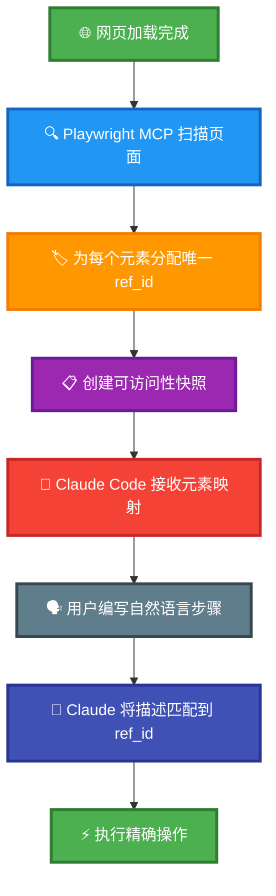
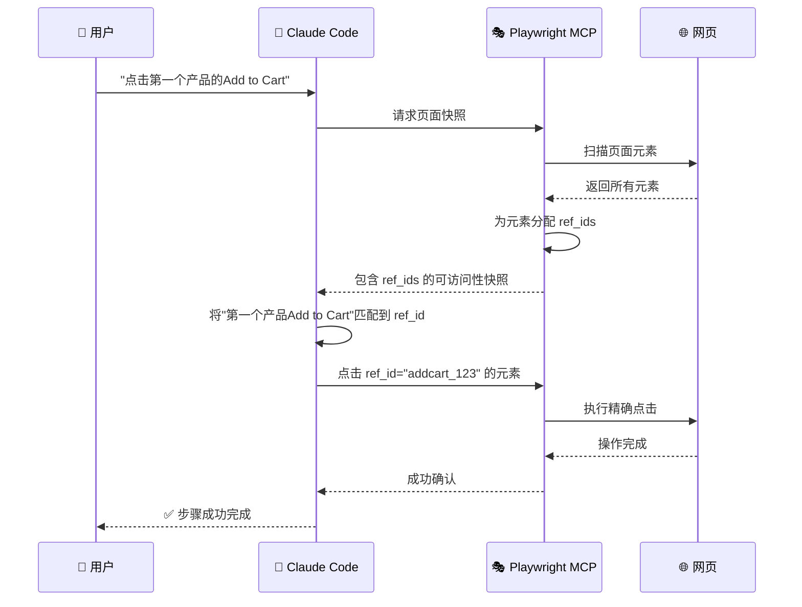

# Playwright YAML 测试框架

[](https://github.com/terryso/claude-code-playwright-mcp-test/stargazers)
[](https://github.com/terryso/claude-code-playwright-mcp-test/pulls)
[](https://opensource.org/licenses/MIT)
[](https://claude.ai/code)
[](https://github.com/microsoft/playwright-mcp)
[](https://deepwiki.com/terryso/claude-code-playwright-mcp-test)

> **中文文档** | **[English Documentation](README.md)**

一个基于YAML配置的Playwright MCP自动化测试框架，专为Claude Code设计，支持多环境配置、步骤库复用和自然语言测试描述。

## 🧠 Playwright MCP 工作原理 - 核心创新

### 🎯 革命性元素定位系统

与传统的Playwright自动化依赖脆弱的CSS选择器或XPath表达式不同，**Playwright MCP使用革命性的动态元素识别系统**：



#### 🎯 **动态ref_id生成**
当Playwright MCP访问网页时，会自动：
1. **扫描页面上所有可交互元素**（按钮、输入框、链接等）
2. **为每个元素动态分配唯一的ref_id属性**
3. **创建包含元素描述和对应ref_id的可访问性快照**
4. **将此映射提供给Claude Code**进行智能元素选择

#### 🎯 **智能元素选择**
Claude Code无需猜测选择器，可以：
- **准确看到页面上存在哪些元素**，包含人类可读的描述
- **通过唯一的ref_id引用元素**，100%准确定位
- **避免传统自动化中脆弱的选择器失败**问题
- **处理动态内容**，无需手动更新选择器

#### 🎯 **自然语言到精确操作**
```yaml
# 你的YAML测试步骤:
- "Click Add to Cart button for first product"

# 幕后发生的过程:
# 1. Playwright MCP识别所有"Add to Cart"按钮
# 2. 分配ref_ids: button[ref_id="addcart_123"], button[ref_id="addcart_456"]
# 3. Claude Code智能选择第一个: ref_id="addcart_123"
# 4. 执行精确的点击操作，无需猜测选择器
```

#### 🎯 **相比传统自动化的优势**
| 传统方法 | Playwright MCP方法 |
|---------|------------------|
| `page.click('#add-cart-btn-1')` | Claude看到"Sauce Labs Backpack的Add to Cart按钮"及其ref_id |
| 脆弱的CSS选择器 | 动态元素识别 |
| HTML变化时会失效 | 自动适应页面结构变化 |
| 需要手动维护 | 自愈性元素检测 |
| 多次重试尝试 | 首次即可准确定位 |



**这就是我们基于YAML的方法如此强大的原因** - **你用自然语言编写，Playwright MCP自动处理复杂的元素定位**。

## 🎬 演示视频

观看YAML-based Playwright测试的实际演示：

[](https://www.youtube.com/watch?v=tx3xExU_Xhc)

**📺 [观看演示视频](https://www.youtube.com/watch?v=tx3xExU_Xhc)** - 了解如何使用Claude Code和Playwright MCP通过自然语言编写和执行测试。

## 📊 最新测试结果

查看最近的测试执行报告：

**📈 [最新测试报告](reports/test/latest-test-report.html)** - 每次测试运行后自动生成，显示详细的执行结果、截图和性能指标。

### 测试报告示例

以下是典型测试执行报告的展示：


**报告特性：**
- 📊 **综合统计**: 总用例数、通过/失败计数、步骤执行详情
- 📋 **配置详情**: 环境设置、报告生成设置、文件路径
- 🎯 **成功指标**: 清晰的测试结果和成功率可视化
- 🔧 **环境信息**: 自动检测和显示测试环境配置

## 🌟 主要特性

- **🌍 多环境支持**: 支持dev/test/prod环境，自动加载对应配置
- **📚 步骤库复用**: 可复用的参数化步骤库，提高测试效率
- **🗣️ 自然语言**: 直接使用自然语言描述测试步骤，易读易写
- **🔧 环境变量**: 从.env文件自动加载配置，安全管理敏感信息
- **📊 智能报告**: 可配置的测试报告生成，支持内嵌数据的HTML/JSON格式
- **📝 智能提示**: Claude Code项目命令支持参数提示
- **⚡ 自动化处理**: YAML测试处理器脚本，提高测试用例分析和执行效率
- **🚀 会话持久化**: 革命性的跨命令会话持久化，一次登录终生受益
- **🔄 性能提升**: 首次登录后80-95%的性能提升，极速测试执行
- **🗂️ 测试套件**: 组织和执行多个测试用例，支持套件级配置和报告

## 🗺️ 开发路线图

我们正在积极开发令人兴奋的新功能，让基于YAML的测试更加强大：

### ✅ 已完成特性

#### ✅ **Cursor IDE 支持** - **已完成** 🎉
- **✅ 项目规则集成**: 完整的 `.mdc` 规则文件，实现Cursor AI集成
- **✅ 命令支持**: 在Cursor中完整支持 `/run-yaml-test` 命令
- **✅ 会话持久化**: 在Cursor中实现与Claude Code相同的80-95%性能提升
- **✅ 跨平台兼容**: 统一框架在两个IDE中无缝运行

### ✅ 已完成特性

#### ✅ **测试套件支持** - **已完成** 🎉
- **✅ 套件组织**: 将相关测试用例组织成逻辑套件
- **✅ 批量执行**: 用单个命令运行整个测试套件
- **✅ 套件级配置**: 每个套件的环境变量和设置
- **✅ 套件报告**: 跨多个测试用例的聚合报告
- **✅ 前置/后置操作**: 套件级的设置和清理操作
- **✅ 验证命令**: 完整的套件验证功能

```yaml
# 示例: test-suites/e-commerce.yml
name: "电商测试套件"
description: "完整的电商工作流测试"
tags:
  - e-commerce
  - integration
test-cases:
  - "test-cases/login.yml"
  - "test-cases/product-details.yml"
  - "test-cases/cart-operations.yml"
  - "test-cases/checkout.yml"
```

**可用的套件命令**:
- `/run-test-suite suite:e-commerce.yml env:test`
- `/validate-test-suite suite:smoke-tests.yml env:dev`

### 📅 发布时间表

| 特性 | 状态 | 预期发布 |
|------|------|----------|
| ✅ Cursor IDE 支持 | ✅ **已完成** | ✅ **已发布** |
| ✅ 测试套件支持 | ✅ **已完成** | ✅ **已发布** |

### 💡 功能请求

有新功能的想法？我们很乐意听到您的声音！
- 提交 [Issue](https://github.com/terryso/claude-code-playwright-mcp-test/issues) 并添加 `enhancement` 标签
- 参与我们的社区讨论
- 为路线图规划贡献力量

## 🔧 前置要求

### 安装 Playwright MCP

本项目依赖 Playwright MCP 来执行浏览器自动化。**重要**：使用以下命令安装以启用会话持久化功能：

```bash
claude mcp add playwright -- npx -y @playwright/mcp@latest \
  --user-data-dir ~/.cache/claude-playwright \
  --storage-state ~/.cache/claude-playwright/auth-state.json \
  --save-trace \
  --output-dir ~/CascadeProjects/claude-code-playwright-mcp-test/screenshots
```

**新功能说明**：
- `--storage-state`: 自动保存和恢复登录状态
- `--user-data-dir`: 持久化浏览器数据
- `--save-trace`: 保存调试跟踪文件
- `--output-dir`: 指定截图输出目录

更多安装信息请参考：[Playwright MCP 官方仓库](https://github.com/microsoft/playwright-mcp)

## 📁 项目结构

```
├── .claude/                    # Claude Code 项目命令
│   └── commands/              # 命令目录
│       ├── run-yaml-test.md   # 执行测试命令
│       ├── validate-yaml-test.md # 验证测试命令
│       ├── run-test-suite.md  # 执行测试套件命令
│       └── validate-test-suite.md # 验证测试套件命令
├── .env.example               # 环境变量模板
├── .env.dev                   # 开发环境配置
├── .env.test                  # 测试环境配置
├── .env.prod                  # 生产环境配置
├── steps/                     # 可复用步骤库
│   ├── login.yml              # 传统登录步骤库
│   ├── session-persist.yml    # 🆕 持久化会话管理
│   ├── session-check.yml      # 智能会话检查
│   ├── ensure-products-page.yml # 导航到产品页面
│   └── cleanup.yml            # 清理步骤库
├── test-cases/                # 测试用例
│   ├── order.yml              # 订单测试用例
│   ├── sort-optimized.yml     # 会话优化的排序测试
│   └── product-details.yml    # 产品详情测试用例
├── test-suites/               # 测试套件 (新功能)
│   ├── e-commerce.yml         # 电商测试套件
│   ├── smoke-tests.yml        # 冒烟测试套件
│   └── regression.yml         # 回归测试套件
├── screenshots/               # 测试截图（按环境分类）
├── reports/                   # 测试报告（按环境分类）
├── CLAUDE.md                  # 项目说明和命令索引
└── README.md                  # 本文档
```

## 🚀 快速开始

### 1. 安装依赖

确保已安装 Playwright MCP（参考上面的前置要求）。

> 💡 **初次使用？** 建议先观看我们的[演示视频](https://www.youtube.com/watch?v=tx3xExU_Xhc)了解框架的实际使用！

### 2. 配置环境变量

编辑对应环境的配置文件：

```bash
# 开发环境
.env.dev

# 测试环境  
.env.test

# 生产环境
.env.prod
```

### 3. 执行测试

```bash
# 在Claude Code中使用项目命令，执行订单测试
/run-yaml-test file:test-cases/order.yml env:dev
```

## 📋 命令详解

### 🚀 执行测试

#### `/run-yaml-test`
执行YAML测试用例，支持多环境配置、标签过滤和报告生成。

#### `/run-test-suite`
执行YAML测试套件，包含多个有序测试用例，支持套件级配置和报告。

**测试用例参数：**
- `file` (可选): 测试用例文件路径，不传则执行test-cases目录下所有用例
- `env` (可选): 环境名称 (dev/test/prod)，默认为 dev
- `tags` (可选): 标签过滤，支持单个或多个标签组合

**测试套件参数：**
- `suite` (可选): 测试套件文件路径，不传则执行test-suites目录下所有套件
- `env` (可选): 环境名称 (dev/test/prod)，默认为套件配置的环境或 dev
- `tags` (可选): 套件级和测试级标签过滤

**标签过滤语法：**
- 单个标签: `smoke`
- 多个标签AND: `smoke,login` (必须同时包含)
- 多个标签OR: `smoke|login` (包含任一)
- 混合条件: `smoke,login|critical`

**报告生成：**
- 根据环境变量 `GENERATE_REPORT` 自动生成测试报告
- 支持 HTML/JSON 格式（由 `REPORT_FORMAT` 配置）
- 报告样式由 `REPORT_STYLE` 控制（overview/detailed）
- 报告保存到 `REPORT_PATH` 指定目录

**示例：**
```bash
# 执行指定文件
/run-yaml-test file:test-cases/order.yml env:dev

# 执行所有smoke标签的测试
/run-yaml-test tags:smoke env:prod

# 执行包含smoke且包含order的测试
/run-yaml-test tags:smoke,order env:test

# 执行包含order或checkout标签的测试
/run-yaml-test tags:order|checkout env:dev

# 执行所有测试用例
/run-yaml-test env:dev

# 执行指定测试套件
/run-test-suite suite:e-commerce.yml env:test

# 执行所有冒烟测试套件
/run-test-suite tags:smoke env:dev

# 执行所有测试套件
/run-test-suite env:test
```

### ✅ 验证测试

#### `/validate-yaml-test`
验证YAML测试用例的语法和引用完整性。

#### `/validate-test-suite`
验证YAML测试套件配置和测试用例引用完整性。

**测试用例验证参数：**
- `file` (必需): 要验证的测试用例文件路径
- `env` (可选): 环境名称，用于验证环境变量

**测试套件验证参数：**
- `suite` (必需): 要验证的测试套件文件路径
- `env` (可选): 环境名称，用于验证环境变量

**示例：**
```bash
# 验证测试用例
/validate-yaml-test file:test-cases/complex-test.yml env:test

# 验证测试套件
/validate-test-suite suite:e-commerce.yml env:test
```

## 📝 YAML格式说明

### 测试套件格式

测试套件用简洁、清晰的配置组织多个测试用例：

```yaml
# test-suites/e-commerce.yml
name: "电商测试套件"
description: "完整的电商工作流测试，涵盖用户注册、产品浏览、购物车操作和结账流程"
tags:
  - e-commerce
  - integration
  - critical
  - smoke

# 按顺序执行的测试用例
test-cases:
  - "test-cases/order.yml"
  - "test-cases/product-details.yml"
  - "test-cases/sort-optimized.yml"
```

### 步骤库格式

步骤库使用简洁的自然语言描述：

```yaml
# steps/login.yml
# 支持的环境变量: BASE_URL, TEST_USERNAME, TEST_PASSWORD
steps:
  - "Open {{BASE_URL}} page"
  - "Fill username field with {{TEST_USERNAME}}"
  - "Fill password field with {{TEST_PASSWORD}}"
  - "Click login button"
  - "Verify page displays Swag Labs"
```

### 测试用例格式

测试用例包含标签和步骤，可以引用步骤库或直接定义步骤：

```yaml
# test-cases/order.yml
# 环境变量将从 .env.{environment} 文件自动加载
tags:
  - smoke
  - order  
  - checkout
steps:
  - include: "login"                           # 引用登录步骤库
  - "Click Add to Cart button for first product"      # 直接定义步骤
  - "Click Add to Cart button for second product"
  - "Click shopping cart icon in top right"
  - "Enter First Name"
  - "Enter Last Name"
  - "Enter Postal Code"
  - "Click Continue button"
  - "Click Finish button"
  - "Verify page displays Thank you for your order!"
  - include: "cleanup"                         # 引用清理步骤库
```

## 🔧 环境配置

### 环境变量说明

支持的环境变量类型：

```bash
# .env.dev 示例
# 基础配置
BASE_URL=https://dev.myapp.com

# 测试账号
TEST_USERNAME=dev_admin
TEST_PASSWORD=dev123

# 普通用户账号
USER_USERNAME=dev_user@example.com
USER_PASSWORD=devpass123

# 浏览器配置
BROWSER_TIMEOUT=30000

# 文件路径
SCREENSHOT_PATH=screenshots/dev
REPORT_PATH=reports/dev

# 报告配置
GENERATE_REPORT=true
REPORT_FORMAT=html
REPORT_STYLE=detailed
```

### 多环境切换

```bash
# 开发环境
/run-yaml-test file:test-cases/order.yml env:dev

# 测试环境
/run-yaml-test file:test-cases/order.yml env:test

# 生产环境
/run-yaml-test file:test-cases/order.yml env:prod
```

## 📚 最佳实践

### 1. 步骤库设计

- **单一职责**: 每个步骤库专注一个功能领域
- **参数化**: 使用环境变量而非硬编码值
- **可复用**: 设计通用的步骤，多个测试用例可复用

```yaml
# ✅ 好的步骤库设计
# steps/form-validation.yml
steps:
  - "Fill {{FIELD_NAME}} field with {{INVALID_VALUE}}"
  - "Click submit button"
  - "Verify page displays error message: {{ERROR_MESSAGE}}"
```

### 2. 测试用例组织

- **标签分类**: 使用合理的标签对测试用例分类
- **逻辑分组**: 按功能模块组织测试用例  
- **环境适配**: 考虑不同环境的差异
- **清理机制**: 每个测试后进行适当清理

```yaml
# ✅ 好的测试用例结构
tags:
  - smoke        # 冒烟测试
  - login        # 登录功能
  - critical     # 关键功能
steps:
  - include: "setup"           # 测试准备
  - include: "login"           # 登录
  - "Execute core test steps"  # 主要测试逻辑
  - include: "cleanup"         # 清理环境
```

### 3. 标签策略

- **功能标签**: 按功能模块分类，如login、user、api
- **优先级标签**: 如critical、high、medium、low
- **类型标签**: 如smoke、regression、integration
- **环境标签**: 如dev-only、prod-safe

### 4. 环境配置

- **敏感信息**: 所有密码、API密钥使用环境变量
- **环境隔离**: 不同环境使用独立的配置文件
- **文档化**: 在.env.example中说明所有必需变量

## 🤝 贡献指南

1. Fork 项目
2. 创建功能分支 (`git checkout -b feature/amazing-feature`)
3. 提交更改 (`git commit -m 'Add some amazing feature'`)
4. 推送到分支 (`git push origin feature/amazing-feature`)
5. 开启 Pull Request

## 📄 许可证

本项目采用 MIT 许可证 - 查看 [LICENSE](LICENSE) 文件了解详情。

## 📺 相关资源

- **🎬 [演示视频](https://www.youtube.com/watch?v=tx3xExU_Xhc)** - 框架实际演示
- **📈 [最新测试报告](reports/test/latest-test-report.html)** - 最近的测试执行结果
- **📖 [Medium文章](https://medium.com/@oxtiger/stop-writing-brittle-playwright-tests-why-yaml-based-testing-is-the-future-5cc90a81bfa2)** - 详细解释和优势
- **🛠️ [Claude Code](https://claude.ai/code)** - AI驱动的开发环境
- **🎭 [Playwright MCP](https://github.com/microsoft/playwright-mcp)** - 浏览器自动化集成

## 🆘 支持

如果你遇到问题或有建议：

1. 观看[演示视频](https://www.youtube.com/watch?v=tx3xExU_Xhc)获取视觉指导
2. 查看本README文档
3. 检查 [Issues](https://github.com/terryso/claude-code-playwright-mcp-test/issues) 
4. 创建新的Issue描述问题
5. 在Claude Code中使用 `/help` 获取更多帮助

---

**Happy Testing! 🚀**