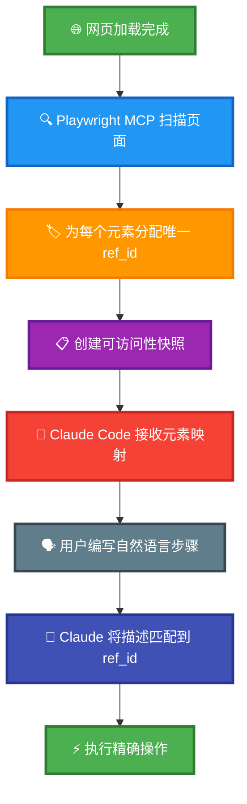

# Claude 测试框架 - 演示项目

[](https://github.com/terryso/claude-code-playwright-mcp-test/stargazers)
[](https://github.com/terryso/claude-code-playwright-mcp-test/pulls)
[](https://opensource.org/licenses/MIT)
[](https://claude.ai/code)
[](https://github.com/microsoft/playwright-mcp)
[](https://deepwiki.com/terryso/claude-code-playwright-mcp-test)
[](https://github.com/terryso/claude-test)

> **中文文档** | **[English Documentation](README.md)**

**[claude-test CLI框架](https://github.com/terryso/claude-test)** 的**实时演示项目** - 展示由 **Claude Code + Playwright MCP** 驱动的智能自动化测试，具备基于自然语言的YAML测试配置、动态元素定位、多环境支持和会话持久化功能。

## 🚀 关于本项目

这是 **[claude-test CLI工具](https://github.com/terryso/claude-test)** 的**演示和示例项目**。虽然本项目包含可运行的测试用例和完整文档，但**实际的框架代码和CLI命令已迁移到官方 `claude-test` npm包中**。

## 🧠 Playwright MCP 工作原理 - 核心创新

### 🎯 革命性元素定位系统

与传统的Playwright自动化依赖脆弱的CSS选择器或XPath表达式不同，**Playwright MCP使用革命性的动态元素识别系统**：



#### 🎯 **动态ref_id生成**
当Playwright MCP访问网页时，会自动：
1. **扫描页面上所有可交互元素**（按钮、输入框、链接等）
2. **为每个元素动态分配唯一的ref_id属性**
3. **创建包含元素描述和对应ref_id的可访问性快照**
4. **将此映射提供给Claude Code**进行智能元素选择

#### 🎯 **智能元素选择**
Claude Code无需猜测选择器，可以：
- **准确看到页面上存在哪些元素**，包含人类可读的描述
- **通过唯一的ref_id引用元素**，100%准确定位
- **避免传统自动化中脆弱的选择器失败**问题
- **处理动态内容**，无需手动更新选择器

#### 🎯 **自然语言到精确操作**
```yaml
# 你的YAML测试步骤:
- "Click Add to Cart button for first product"

# 幕后发生的过程:
# 1. Playwright MCP识别所有"Add to Cart"按钮
# 2. 分配ref_ids: button[ref_id="addcart_123"], button[ref_id="addcart_456"]
# 3. Claude Code智能选择第一个: ref_id="addcart_123"
# 4. 执行精确的点击操作，无需猜测选择器
```

#### 🎯 **相比传统自动化的优势**
| 传统方法 | Playwright MCP方法 |
|---------|------------------|
| `page.click('#add-cart-btn-1')` | Claude看到"Sauce Labs Backpack的Add to Cart按钮"及其ref_id |
| 脆弱的CSS选择器 | 动态元素识别 |
| HTML变化时会失效 | 自动适应页面结构变化 |
| 需要手动维护 | 自愈性元素检测 |
| 多次重试尝试 | 首次即可准确定位 |

**这就是我们基于YAML的方法如此强大的原因** - **你用自然语言编写，Playwright MCP自动处理复杂的元素定位**。

## 🎬 演示视频

观看YAML-based Playwright测试的实际演示：

[](https://www.youtube.com/watch?v=tx3xExU_Xhc)

**📺 [观看演示视频](https://www.youtube.com/watch?v=tx3xExU_Xhc)** - 了解如何使用Claude Code和Playwright MCP通过自然语言编写和执行测试。

## 🌟 主要特性

- **🌍 多环境支持**: 支持dev/test/prod环境，自动加载对应配置
- **📚 步骤库复用**: 可复用的参数化步骤库，提高测试效率
- **🗣️ 自然语言**: 直接使用自然语言描述测试步骤，易读易写
- **🔧 环境变量**: 从.env文件自动加载配置，安全管理敏感信息
- **📊 智能报告**: 可配置的测试报告生成，支持内嵌数据的HTML/JSON格式
- **📝 智能提示**: Claude Code项目命令支持参数提示
- **🚀 会话持久化**: 革命性的跨命令会话持久化，一次登录终生受益
- **⚡ 性能提升**: 首次登录后80-95%的性能提升，极速测试执行

## 🗺️ 开发路线图

我们正在积极开发令人兴奋的新功能，让基于YAML的测试更加强大：

### ✅ 已完成特性

#### ✅ **Cursor IDE 支持** - **已完成** 🎉
- **✅ 项目规则集成**: 完整的 `.mdc` 规则文件，实现Cursor AI集成
- **✅ 命令支持**: 在Cursor中完整支持 `/run-yaml-test` 命令
- **✅ 会话持久化**: 在Cursor中实现与Claude Code相同的80-95%性能提升
- **✅ 跨平台兼容**: 统一框架在两个IDE中无缝运行

#### ✅ **测试套件支持** - **已完成** 🎉
- **✅ 套件组织**: 将相关测试用例组织成逻辑套件
- **✅ 批量执行**: 用单个命令运行整个测试套件
- **✅ 套件级配置**: 每个套件的环境变量和设置
- **✅ 套件报告**: 跨多个测试用例的聚合报告
- **✅ 前置/后置操作**: 套件级的设置和清理操作
- **✅ 验证命令**: 完整的套件验证功能

```yaml
# 示例: test-suites/e-commerce.yml
name: "电商测试套件"
description: "完整的电商工作流测试"
tags:
  - e-commerce
  - integration
test-cases:
  - "test-cases/order.yml"
  - "test-cases/product-details.yml"
  - "test-cases/sort-optimized.yml"
```

**可用的套件命令**:
- `/run-test-suite suite:e-commerce.yml env:test`
- `/validate-test-suite suite:smoke-tests.yml env:dev`

### 📅 发布时间表

| 特性 | 状态 | 预期发布 |
|------|------|----------|
| ✅ Cursor IDE 支持 | ✅ **已完成** | ✅ **已发布** |
| ✅ 测试套件支持 | ✅ **已完成** | ✅ **已发布** |

## 🚀 快速开始

### 1. 安装 claude-test CLI

```bash
npm install -g claude-test
```

### 2. 安装 Playwright MCP

```bash
claude mcp add playwright -- npx -y @playwright/mcp@latest \
  --user-data-dir ~/.cache/claude-playwright \
  --storage-state ~/.cache/claude-playwright/auth-state.json \
  --save-trace \
  --output-dir ~/CascadeProjects/claude-code-playwright-mcp-test/screenshots
```

### 3. 初始化新项目（替代使用此演示项目）

```bash
# 创建包含框架的新项目
cd your-new-project
claude-test init
```

### 4. 或使用此演示项目

```bash
# 克隆演示项目
git clone https://github.com/terryso/claude-code-playwright-mcp-test.git
cd claude-code-playwright-mcp-test

# 执行订单测试
/run-yaml-test file:test-cases/order.yml env:dev

# 查看报告
/view-reports-index
```

### 简单的YAML测试示例

```yaml
# test-cases/example.yml
tags:
  - smoke
steps:
  - include: "login"
  - "Click Add to Cart button for first product"
  - "Click shopping cart icon"
  - "Verify cart contains 1 item"
```

## 📚 文档

- **📖 [安装指南](docs/cn/installation.md)** - 详细的安装说明
- **🏗️ [项目结构](docs/cn/project-structure.md)** - 理解框架结构
- **⚡ [命令详解](docs/cn/commands.md)** - 完整的命令文档
- **📝 [YAML格式说明](docs/cn/yaml-format.md)** - 编写测试用例和步骤库
- **🔧 [环境配置](docs/cn/environment-config.md)** - 多环境设置
- **✨ [最佳实践](docs/cn/best-practices.md)** - 有效测试的技巧

## 📊 最新测试结果

**📈 [最新测试报告](reports/test/latest-test-report.html)** - 每次测试运行后自动生成，显示详细的执行结果、截图和性能指标。

## 💡 功能请求

有新功能的想法？我们很乐意听到您的声音！
- 提交 [Issue](https://github.com/terryso/claude-code-playwright-mcp-test/issues) 并添加 `enhancement` 标签
- 参与我们的社区讨论
- 为路线图规划贡献力量

## 🤝 贡献指南

1. Fork 项目
2. 创建功能分支 (`git checkout -b feature/amazing-feature`)
3. 提交更改 (`git commit -m 'Add some amazing feature'`)
4. 推送到分支 (`git push origin feature/amazing-feature`)
5. 开启 Pull Request

## 📄 许可证

本项目采用 MIT 许可证 - 查看 [LICENSE](LICENSE) 文件了解详情。

## 📺 相关资源

### 🛠️ 官方CLI工具
- **📦 [claude-test CLI](https://github.com/terryso/claude-test)** - **框架管理的官方CLI包**
- **📥 [NPM包](https://www.npmjs.com/package/claude-test)** - 通过npm全局安装
- **📋 [CLI文档](https://github.com/terryso/claude-test#readme)** - 完整使用指南和API参考

### 📖 学习资源
- **🎬 [演示视频](https://www.youtube.com/watch?v=tx3xExU_Xhc)** - 框架实际演示
- **📈 [最新测试报告](reports/test/latest-test-report.html)** - 最近的测试执行结果
- **📖 [Medium文章](https://medium.com/@oxtiger/stop-writing-brittle-playwright-tests-why-yaml-based-testing-is-the-future-5cc90a81bfa2)** - 详细解释和优势

### 🔧 工具和集成
- **🛠️ [Claude Code](https://claude.ai/code)** - AI驱动的开发环境
- **🎭 [Playwright MCP](https://github.com/microsoft/playwright-mcp)** - 浏览器自动化集成

## 🆘 支持

### CLI工具问题
- **🐛 [CLI问题](https://github.com/terryso/claude-test/issues)** - 报告CLI缺陷或功能请求
- **📖 [CLI文档](https://github.com/terryso/claude-test#readme)** - 完整CLI使用指南

### 演示项目问题
1. 观看[演示视频](https://www.youtube.com/watch?v=tx3xExU_Xhc)获取视觉指导
2. 查看[文档](docs/cn/)
3. 检查 [演示项目Issues](https://github.com/terryso/claude-code-playwright-mcp-test/issues) 
4. 创建新的Issue描述问题
5. 在Claude Code中使用 `/help` 获取更多帮助

## 🔗 相关项目

- **📦 [claude-test CLI](https://github.com/terryso/claude-test)** - 框架管理的官方CLI工具
- **🎬 [演示视频](https://www.youtube.com/watch?v=tx3xExU_Xhc)** - YAML测试的实时演示
- **📖 [Medium文章](https://medium.com/@oxtiger/stop-writing-brittle-playwright-tests-why-yaml-based-testing-is-the-future-5cc90a81bfa2)** - 框架深度解析

---

**测试愉快！🚀**

*此演示项目展示了[claude-test CLI框架](https://github.com/terryso/claude-test)的强大功能。对于新项目，请全局安装CLI并使用`claude-test init`开始。*