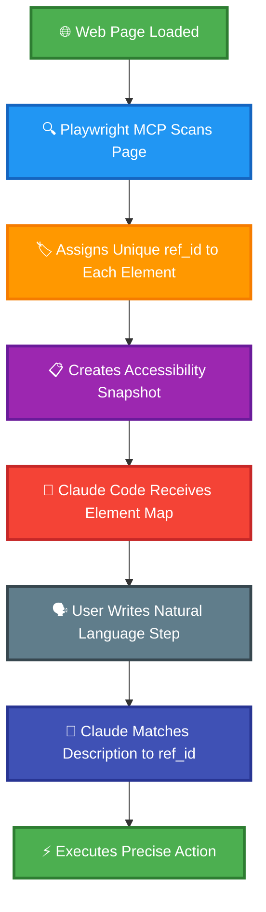
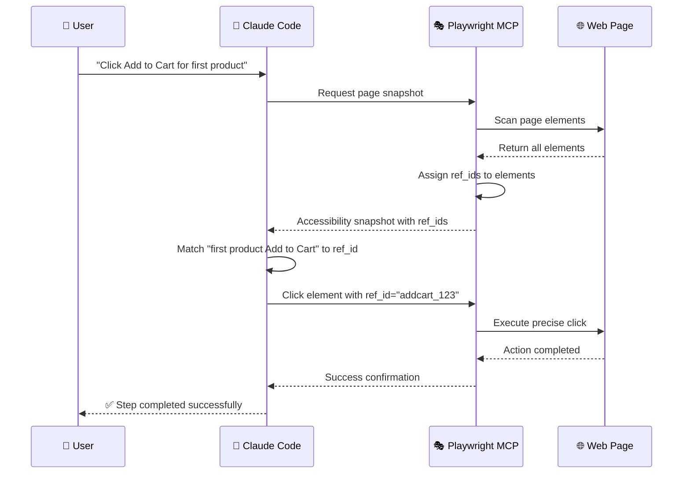

# Claude Code + Playwright MCP YAML Testing Framework

[](https://github.com/terryso/claude-code-playwright-mcp-test/stargazers)
[](https://github.com/terryso/claude-code-playwright-mcp-test/pulls)
[](https://opensource.org/licenses/MIT)
[](https://claude.ai/code)
[](https://github.com/microsoft/playwright-mcp)
[](https://deepwiki.com/terryso/claude-code-playwright-mcp-test)

> **[中文文档](README.cn.md)** | **English Documentation**

An intelligent automation testing framework powered by **Claude Code + Playwright MCP**, enabling natural language YAML-based testing with dynamic element targeting, multi-environment configuration, and session persistence.

## 🧠 How Playwright MCP Works - The Core Innovation

### 🎯 Revolutionary Element Targeting System

Unlike traditional Playwright automation that relies on fragile CSS selectors or XPath expressions, **Playwright MCP uses a revolutionary dynamic element identification system**:



#### 🎯 **Dynamic ref_id Generation**
When Playwright MCP accesses a web page, it automatically:
1. **Scans all interactive elements** on the page (buttons, inputs, links, etc.)
2. **Assigns unique ref_id attributes** to each element dynamically
3. **Creates an accessibility snapshot** with element descriptions and their corresponding ref_ids
4. **Provides this mapping to Claude Code** for intelligent element selection

#### 🎯 **Intelligent Element Selection**
Instead of guessing selectors, Claude Code can:
- **See exactly what elements exist** on the page with human-readable descriptions
- **Reference elements by their unique ref_id** with 100% accuracy
- **Avoid brittle selector-based failures** that plague traditional automation
- **Handle dynamic content** without manual selector updates

#### 🎯 **Natural Language to Precise Actions**
```yaml
# Your YAML test step:
- "Click Add to Cart button for first product"

# What happens behind the scenes:
# 1. Playwright MCP identifies all "Add to Cart" buttons
# 2. Assigns ref_ids: button[ref_id="addcart_123"], button[ref_id="addcart_456"]
# 3. Claude Code intelligently selects the first one: ref_id="addcart_123"
# 4. Executes precise click action without guessing selectors
```

#### 🎯 **Benefits Over Traditional Automation**
| Traditional Approach | Playwright MCP Approach |
|---------------------|------------------------|
| `page.click('#add-cart-btn-1')` | Claude sees "Add to Cart button for Sauce Labs Backpack" with ref_id |
| Brittle CSS selectors | Dynamic element identification |
| Breaks when HTML changes | Adapts to page structure automatically |
| Requires manual maintenance | Self-healing element detection |
| Multiple retry attempts | First-time accurate targeting |



**This is why our YAML-based approach is so powerful** - **you write in natural language, and Playwright MCP handles the complex element targeting automatically**.

## 🎬 Demo Video

Watch the live demonstration of YAML-based Playwright testing in action:

[](https://www.youtube.com/watch?v=tx3xExU_Xhc)

**📺 [Watch Demo Video](https://www.youtube.com/watch?v=tx3xExU_Xhc)** - See how to write and execute tests using natural language with Claude Code and Playwright MCP.

## 📊 Latest Test Results

View the most recent test execution report:

**📈 [Latest Test Report](reports/test/latest-test-report.html)** - Automatically generated after each test run, showing detailed execution results, screenshots, and performance metrics.

### Sample Test Report

Here's what a typical test execution report looks like:


**Report Features:**
- 📊 **Comprehensive Statistics**: Total cases, passed/failed counts, step execution details
- 📋 **Configuration Details**: Environment settings, report generation settings, file paths
- 🎯 **Success Metrics**: Clear visualization of test results and success rates
- 🔧 **Environment Info**: Automatic detection and display of test environment configuration

## 🌟 Key Features

- **🌍 Multi-Environment Support**: Support for dev/test/prod environments with automatic configuration loading
- **📚 Reusable Step Libraries**: Parameterized reusable step libraries to improve testing efficiency
- **🗣️ Natural Language**: Direct use of natural language for test step descriptions, easy to read and write
- **🔧 Environment Variables**: Automatic configuration loading from .env files, secure management of sensitive information
- **📊 Smart Reporting**: Configurable test report generation with embedded data supporting HTML/JSON formats
- **📝 Smart Prompts**: Claude Code project commands support parameter prompts
- **🚀 Session Persistence**: Revolutionary cross-command session persistence - login once, test forever
- **⚡ Performance Boost**: 80-95% performance improvement after first login with persistent sessions

## 🗺️ Development Roadmap

We're actively working on exciting new features to make YAML-based testing even more powerful:

### ✅ Completed Features

#### ✅ **Cursor IDE Support** - **COMPLETED** 🎉
- **✅ Project Rules Integration**: Complete `.mdc` rule file for Cursor AI integration
- **✅ Command Support**: Full `/run-yaml-test` command support in Cursor
- **✅ Session Persistence**: Same 80-95% performance boost in Cursor as Claude Code
- **✅ Cross-Platform Compatibility**: Unified framework works seamlessly in both IDEs

### ✅ Recently Completed Features

#### ✅ **Test Suites Support** - **COMPLETED** 🎉
- **✅ Suite Organization**: Group related test cases into logical suites
- **✅ Batch Execution**: Run entire test suites with a single command
- **✅ Suite-level Configuration**: Environment variables and settings per suite
- **✅ Suite Reporting**: Aggregated reports across multiple test cases
- **✅ Pre/Post Actions**: Suite-level setup and cleanup operations
- **✅ Validation Commands**: Comprehensive suite validation functionality

```yaml
# Example: test-suites/e-commerce.yml
name: "E-commerce Test Suite"
description: "Complete e-commerce workflow testing"
tags:
  - e-commerce
  - integration
test-cases:
  - "test-cases/order.yml"
  - "test-cases/product-details.yml"
  - "test-cases/sort-optimized.yml"
```

**Available Suite Commands**:
- `/run-test-suite suite:e-commerce.yml env:test`
- `/validate-test-suite suite:smoke-tests.yml env:dev`

### 🔄 Upcoming Features

### 📅 Release Timeline

| Feature | Status | Expected Release |
|---------|--------|------------------|
| ✅ Cursor IDE Support | ✅ **Completed** | ✅ **Released** |
| ✅ Test Suites Support | ✅ **Completed** | ✅ **Released** |

### 💡 Feature Requests

Have ideas for new features? We'd love to hear from you!
- Open an [Issue](https://github.com/terryso/claude-code-playwright-mcp-test/issues) with the `enhancement` label
- Join discussions in our community
- Contribute to the roadmap planning

## 🔧 Prerequisites

### Install Playwright MCP

This project depends on Playwright MCP to execute browser automation. **Important**: Use the following command to enable session persistence features:

```bash
claude mcp add playwright -- npx -y @playwright/mcp@latest \
  --user-data-dir ~/.cache/claude-playwright \
  --storage-state ~/.cache/claude-playwright/auth-state.json \
  --save-trace \
  --output-dir ~/CascadeProjects/claude-code-playwright-mcp-test/screenshots
```

**New Features Explained**:
- `--storage-state`: Automatically save and restore login sessions
- `--user-data-dir`: Persistent browser data directory
- `--save-trace`: Save debugging trace files
- `--output-dir`: Specify screenshot output directory

For more installation information, please refer to: [Playwright MCP Official Repository](https://github.com/microsoft/playwright-mcp)

## 📁 Project Structure

```
├── .claude/                    # Claude Code project commands
│   └── commands/              # Commands directory
│       ├── run-yaml-test.md   # Execute test command
│       ├── validate-yaml-test.md # Validate test command
│       ├── run-test-suite.md  # Execute test suite command
│       └── validate-test-suite.md # Validate test suite command
├── .env.example               # Environment variable template
├── .env.dev                   # Development environment configuration
├── .env.test                  # Test environment configuration
├── .env.prod                  # Production environment configuration
├── steps/                     # Reusable step libraries
│   ├── login.yml              # Traditional login step library
│   ├── session-persist.yml    # 🆕 Persistent session management
│   ├── session-check.yml      # Intelligent session checking
│   ├── ensure-products-page.yml # Navigate to products page
│   └── cleanup.yml            # Cleanup step library
├── test-cases/                # Test cases
│   ├── order.yml              # Order test case
│   ├── sort-optimized.yml     # Session-optimized sort test
│   └── product-details.yml    # Product details test case
├── test-suites/               # Test suites (NEW)
│   ├── e-commerce.yml         # E-commerce test suite
│   ├── smoke-tests.yml        # Smoke test suite
│   └── regression.yml         # Regression test suite
├── screenshots/               # Test screenshots (organized by environment)
├── reports/                   # Test reports (organized by environment)
├── CLAUDE.md                  # Project description and command index
└── README.md                  # This document
```

## 🚀 Quick Start

### 1. Install Dependencies

Ensure Playwright MCP is installed (refer to prerequisites above).

> 💡 **New to the project?** Watch our [demo video](https://www.youtube.com/watch?v=tx3xExU_Xhc) first to see the framework in action!

### 2. Configure Environment Variables

Edit the corresponding environment configuration files:

```bash
# Development environment
.env.dev

# Test environment  
.env.test

# Production environment
.env.prod
```

### 3. Execute Tests

```bash
# Use project commands in Claude Code to execute order tests
/run-yaml-test file:test-cases/order.yml env:dev
```

### 4. View Test Reports

```bash
# Launch report index viewer to browse all test reports
/view-reports-index

# Or use npm command
npm run view-reports
```

## 📋 Command Reference

### 🚀 Test Execution

#### `/run-yaml-test`
Execute YAML test cases with multi-environment configuration, tag filtering, and report generation support.

#### `/run-test-suite`
Execute YAML test suites containing multiple organized test cases with suite-level configuration and reporting.

**Test Case Parameters:**
- `file` (optional): Test case file path, if not provided, executes all cases in test-cases directory
- `env` (optional): Environment name (dev/test/prod), defaults to dev
- `tags` (optional): Tag filtering, supports single or multiple tag combinations

**Test Suite Parameters:**
- `suite` (optional): Test suite file path, if not provided, executes all suites in test-suites directory
- `env` (optional): Environment name (dev/test/prod), defaults to suite's configured environment or dev
- `tags` (optional): Tag filtering for both suite-level and test-level tags

**Tag Filtering Syntax:**
- Single tag: `smoke`
- Multiple tags AND: `smoke,login` (must contain both)
- Multiple tags OR: `smoke|login` (contains either)
- Mixed conditions: `smoke,login|critical`

**Report Generation:**
- Automatically generates test reports based on environment variable `GENERATE_REPORT`
- Supports HTML/JSON formats (configured via `REPORT_FORMAT`)
- Reports saved to directory specified by `REPORT_PATH`

**Examples:**
```bash
# Execute specific file
/run-yaml-test file:test-cases/order.yml env:dev

# Execute all smoke tagged tests
/run-yaml-test tags:smoke env:prod

# Execute tests containing both smoke and order tags
/run-yaml-test tags:smoke,order env:test

# Execute tests containing order or checkout tags
/run-yaml-test tags:order|checkout env:dev

# Execute all test cases
/run-yaml-test env:dev

# Execute specific test suite
/run-test-suite suite:e-commerce.yml env:test

# Execute all smoke test suites
/run-test-suite tags:smoke env:dev

# Execute all test suites
/run-test-suite env:test
```

### ✅ Test Validation

#### `/validate-yaml-test`
Validate YAML test case syntax and reference completeness.

#### `/validate-test-suite`
Validate YAML test suite configuration and test case references.

**Test Case Validation Parameters:**
- `file` (required): Path to test case file to validate
- `env` (optional): Environment name for environment variable validation

**Test Suite Validation Parameters:**
- `suite` (required): Path to test suite file to validate
- `env` (optional): Environment name for environment variable validation

**Examples:**
```bash
# Validate test case
/validate-yaml-test file:test-cases/complex-test.yml env:test

# Validate test suite
/validate-test-suite suite:e-commerce.yml env:test
```

### 📊 Report Management

#### `/view-reports-index`
Launch a comprehensive test report index viewer with environment switching and report browsing capabilities.

**Features:**
- 📊 **Auto-discovery**: Automatically scans all environments for test reports
- 🎯 **Environment Switching**: Support for dev/test/prod environment tab switching
- 📈 **Statistics**: Shows report statistics for each environment
- 🔍 **Report Details**: Displays report type, size, generation time, and other information
- 📱 **Responsive Design**: Supports desktop and mobile device access
- 🌐 **Local Server**: Runs on localhost:8080 with auto browser opening

**What it does:**
1. **Refresh Report Index**: Scans all environment directories and generates latest report list
2. **Start Local Server**: Launches HTTP server to host the report index page
3. **Open Browser**: Automatically opens the report index page in your browser

**No parameters required** - automatically scans all environments.

**Report Types Supported:**
- **Suite Reports**: Multi-test case suite execution reports
- **Test Reports**: Individual test case detailed execution reports  
- **Batch Reports**: Comprehensive reports for batch test executions

**Examples:**
```bash
# Launch report index viewer (Claude Code command)
/view-reports-index

# The command will:
# 1. Scan reports/dev/, reports/test/, reports/prod/ directories
# 2. Generate reports/index.json data file
# 3. Start local HTTP server on port 8080
# 4. Open http://localhost:8080/index.html in browser
```

**Manual npm startup** (alternative method):
```bash
# Method 1: Using npm script (recommended)
npm run view-reports

# Method 2: Using alternative npm script
npm run reports-server

# Method 3: Direct node command
node scripts/start-report-server.js

# All methods will:
# - Automatically scan all environment reports
# - Start HTTP server on localhost:8080
# - Open browser automatically
# - Provide real-time report management interface
```

**Server Features:**
- 🌐 **Auto Browser Opening**: Automatically opens http://localhost:8080/index.html
- 🔄 **Live Refresh**: Manual refresh button to update report lists
- 📊 **Real-time Statistics**: Environment-based report counts and statistics
- 🎯 **Environment Filtering**: Tab-based environment switching (dev/test/prod)
- 📱 **Responsive UI**: Works on desktop and mobile devices
- 🔍 **Report Search**: Easy browsing and filtering of test reports

## 📝 YAML Format Guide

### Step Library Format

Step libraries use concise natural language descriptions:

```yaml
# steps/login.yml
# Supported environment variables: BASE_URL, TEST_USERNAME, TEST_PASSWORD
steps:
  - "Open {{BASE_URL}} page"
  - "Fill username field with {{TEST_USERNAME}}"
  - "Fill password field with {{TEST_PASSWORD}}"
  - "Click login button"
  - "Verify page displays Swag Labs"
```

### Test Case Format

Test cases contain tags and steps, can reference step libraries or define steps directly:

```yaml
# test-cases/order.yml
# Environment variables are automatically loaded from .env.{environment} files
tags:
  - smoke
  - order  
  - checkout
steps:
  - include: "login"                           # Reference login step library
  - "Click Add to Cart button for first product"      # Direct step definition
  - "Click Add to Cart button for second product"
  - "Click shopping cart icon in top right"
  - "Enter First Name"
  - "Enter Last Name"
  - "Enter Postal Code"
  - "Click Continue button"
  - "Click Finish button"
  - "Verify page displays Thank you for your order!"
  - include: "cleanup"                         # Reference cleanup step library
```

### Test Suite Format

Test suites organize multiple test cases with simple, clean configuration:

```yaml
# test-suites/e-commerce.yml
name: "E-commerce Test Suite"
description: "Complete e-commerce workflow testing covering user registration, product browsing, cart operations, and checkout process"
tags:
  - e-commerce
  - integration
  - critical
  - smoke

# Test cases to execute in order
test-cases:
  - "test-cases/order.yml"
  - "test-cases/product-details.yml"
  - "test-cases/sort-optimized.yml"
```

**Key Features of Simplified Format**:
- **Clean Configuration**: Only essential fields - name, description, tags, and test-cases
- **Simple Test Case Lists**: Direct file paths without extra metadata
- **Environment via .env**: All environment configuration through standard .env files
- **Minimal Complexity**: Easy to read, write, and maintain

## 🔧 Environment Configuration

### Environment Variable Reference

Supported environment variable types:

```bash
# .env.dev example
# Basic configuration
BASE_URL=https://dev.myapp.com

# Test account
TEST_USERNAME=dev_admin
TEST_PASSWORD=dev123

# Regular user account
USER_USERNAME=dev_user@example.com
USER_PASSWORD=devpass123

# Browser configuration
BROWSER_TIMEOUT=30000

# File paths
SCREENSHOT_PATH=screenshots/dev
REPORT_PATH=reports/dev

# Report configuration
GENERATE_REPORT=true
REPORT_FORMAT=html
```

### Multi-Environment Switching

```bash
# Development environment
/run-yaml-test file:test-cases/order.yml env:dev

# Test environment
/run-yaml-test file:test-cases/order.yml env:test

# Production environment
/run-yaml-test file:test-cases/order.yml env:prod
```

## 📚 Best Practices

### 1. Step Library Design

- **Single Responsibility**: Each step library focuses on one functional area
- **Parameterization**: Use environment variables instead of hardcoded values
- **Reusability**: Design generic steps that can be reused by multiple test cases

```yaml
# ✅ Good step library design
# steps/form-validation.yml
steps:
  - "Fill {{FIELD_NAME}} field with {{INVALID_VALUE}}"
  - "Click submit button"
  - "Verify page displays error message: {{ERROR_MESSAGE}}"
```

### 2. Test Case Organization

- **Tag Classification**: Use reasonable tags to classify test cases
- **Logical Grouping**: Organize test cases by functional modules  
- **Environment Adaptation**: Consider differences between environments
- **Cleanup Mechanism**: Perform appropriate cleanup after each test

```yaml
# ✅ Good test case structure
tags:
  - smoke        # Smoke test
  - login        # Login functionality
  - critical     # Critical functionality
steps:
  - include: "setup"           # Test preparation
  - include: "login"           # Login
  - "Execute core test steps"  # Main test logic
  - include: "cleanup"         # Environment cleanup
```

### 3. Tagging Strategy

- **Functional Tags**: Classify by functional modules, e.g., login, user, api
- **Priority Tags**: e.g., critical, high, medium, low
- **Type Tags**: e.g., smoke, regression, integration
- **Environment Tags**: e.g., dev-only, prod-safe

### 4. Environment Configuration

- **Sensitive Information**: Use environment variables for all passwords and API keys
- **Environment Isolation**: Use independent configuration files for different environments
- **Documentation**: Document all required variables in .env.example

## 🤝 Contributing

1. Fork the project
2. Create a feature branch (`git checkout -b feature/amazing-feature`)
3. Commit your changes (`git commit -m 'Add some amazing feature'`)
4. Push to the branch (`git push origin feature/amazing-feature`)
5. Open a Pull Request

## 📄 License

This project is licensed under the MIT License - see the [LICENSE](LICENSE) file for details.

## 📺 Resources

- **🎬 [Demo Video](https://www.youtube.com/watch?v=tx3xExU_Xhc)** - Live demonstration of the framework
- **📈 [Latest Test Report](reports/test/latest-test-report.html)** - Most recent test execution results
- **📖 [Medium Article](https://medium.com/@oxtiger/stop-writing-brittle-playwright-tests-why-yaml-based-testing-is-the-future-5cc90a81bfa2)** - Detailed explanation and benefits
- **🛠️ [Claude Code](https://claude.ai/code)** - AI-powered development environment
- **🎭 [Playwright MCP](https://github.com/microsoft/playwright-mcp)** - Browser automation integration

## 🆘 Support

If you encounter issues or have suggestions:

1. Watch the [demo video](https://www.youtube.com/watch?v=tx3xExU_Xhc) for visual guidance
2. Check this README documentation
3. Review [Issues](https://github.com/terryso/claude-code-playwright-mcp-test/issues) 
4. Create a new Issue describing the problem
5. Use `/help` in Claude Code for more assistance

---

**Happy Testing! 🚀**