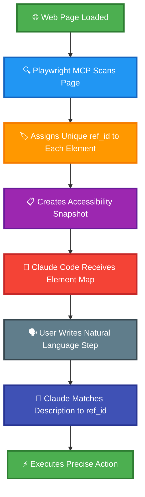

# Claude Test Framework - Demo Project

[](https://github.com/terryso/claude-code-playwright-mcp-test/stargazers)
[](https://github.com/terryso/claude-code-playwright-mcp-test/pulls)
[](https://opensource.org/licenses/MIT)
[](https://claude.ai/code)
[](https://github.com/microsoft/playwright-mcp)
[](https://deepwiki.com/terryso/claude-code-playwright-mcp-test)
[](https://github.com/terryso/claude-test)

> **[中文文档](README.cn.md)** | **English Documentation**

**Live demonstration project** for the **[claude-test CLI framework](https://github.com/terryso/claude-test)** - showcasing intelligent automation testing powered by **Claude Code + Playwright MCP** with natural language YAML-based testing, dynamic element targeting, multi-environment configuration, and session persistence.

## 🚀 About This Project

This is a **demonstration and example project** for the **[claude-test CLI tool](https://github.com/terryso/claude-test)**. While this project contains working test cases and comprehensive documentation, **the actual framework code and CLI commands have been moved to the official `claude-test` npm package**.

## 🧠 How Playwright MCP Works - The Core Innovation

### 🎯 Revolutionary Element Targeting System

Unlike traditional Playwright automation that relies on fragile CSS selectors or XPath expressions, **Playwright MCP uses a revolutionary dynamic element identification system**:



#### 🎯 **Dynamic ref_id Generation**
When Playwright MCP accesses a web page, it automatically:
1. **Scans all interactive elements** on the page (buttons, inputs, links, etc.)
2. **Assigns unique ref_id attributes** to each element dynamically
3. **Creates an accessibility snapshot** with element descriptions and their corresponding ref_ids
4. **Provides this mapping to Claude Code** for intelligent element selection

#### 🎯 **Intelligent Element Selection**
Instead of guessing selectors, Claude Code can:
- **See exactly what elements exist** on the page with human-readable descriptions
- **Reference elements by their unique ref_id** with 100% accuracy
- **Avoid brittle selector-based failures** that plague traditional automation
- **Handle dynamic content** without manual selector updates

#### 🎯 **Natural Language to Precise Actions**
```yaml
# Your YAML test step:
- "Click Add to Cart button for first product"

# What happens behind the scenes:
# 1. Playwright MCP identifies all "Add to Cart" buttons
# 2. Assigns ref_ids: button[ref_id="addcart_123"], button[ref_id="addcart_456"]
# 3. Claude Code intelligently selects the first one: ref_id="addcart_123"
# 4. Executes precise click action without guessing selectors
```

#### 🎯 **Benefits Over Traditional Automation**
| Traditional Approach | Playwright MCP Approach |
|---------------------|------------------------|
| `page.click('#add-cart-btn-1')` | Claude sees "Add to Cart button for Sauce Labs Backpack" with ref_id |
| Brittle CSS selectors | Dynamic element identification |
| Breaks when HTML changes | Adapts to page structure automatically |
| Requires manual maintenance | Self-healing element detection |
| Multiple retry attempts | First-time accurate targeting |

**This is why our YAML-based approach is so powerful** - **you write in natural language, and Playwright MCP handles the complex element targeting automatically**.

## 🎬 Demo Video

Watch the live demonstration of YAML-based Playwright testing in action:

[](https://www.youtube.com/watch?v=tx3xExU_Xhc)

**📺 [Watch Demo Video](https://www.youtube.com/watch?v=tx3xExU_Xhc)** - See how to write and execute tests using natural language with Claude Code and Playwright MCP.

## 🌟 Key Features

- **🌍 Multi-Environment Support**: Support for dev/test/prod environments with automatic configuration loading
- **📚 Reusable Step Libraries**: Parameterized reusable step libraries to improve testing efficiency
- **🗣️ Natural Language**: Direct use of natural language for test step descriptions, easy to read and write
- **🔧 Environment Variables**: Automatic configuration loading from .env files, secure management of sensitive information
- **📊 Smart Reporting**: Configurable test report generation with embedded data supporting HTML/JSON formats
- **📝 Smart Prompts**: Claude Code project commands support parameter prompts
- **🚀 Session Persistence**: Revolutionary cross-command session persistence - login once, test forever
- **⚡ Performance Boost**: 80-95% performance improvement after first login with persistent sessions

## 🗺️ Development Roadmap

We're actively working on exciting new features to make YAML-based testing even more powerful:

### ✅ Completed Features

#### ✅ **Cursor IDE Support** - **COMPLETED** 🎉
- **✅ Project Rules Integration**: Complete `.mdc` rule file for Cursor AI integration
- **✅ Command Support**: Full `/run-yaml-test` command support in Cursor
- **✅ Session Persistence**: Same 80-95% performance boost in Cursor as Claude Code
- **✅ Cross-Platform Compatibility**: Unified framework works seamlessly in both IDEs

#### ✅ **Test Suites Support** - **COMPLETED** 🎉
- **✅ Suite Organization**: Group related test cases into logical suites
- **✅ Batch Execution**: Run entire test suites with a single command
- **✅ Suite-level Configuration**: Environment variables and settings per suite
- **✅ Suite Reporting**: Aggregated reports across multiple test cases
- **✅ Pre/Post Actions**: Suite-level setup and cleanup operations
- **✅ Validation Commands**: Comprehensive suite validation functionality

```yaml
# Example: test-suites/e-commerce.yml
name: "E-commerce Test Suite"
description: "Complete e-commerce workflow testing"
tags:
  - e-commerce
  - integration
test-cases:
  - "test-cases/order.yml"
  - "test-cases/product-details.yml"
  - "test-cases/sort-optimized.yml"
```

**Available Suite Commands**:
- `/run-test-suite suite:e-commerce.yml env:test`
- `/validate-test-suite suite:smoke-tests.yml env:dev`

### 📅 Release Timeline

| Feature | Status | Expected Release |
|---------|--------|------------------|
| ✅ Cursor IDE Support | ✅ **Completed** | ✅ **Released** |
| ✅ Test Suites Support | ✅ **Completed** | ✅ **Released** |

## 🚀 Quick Start

### 1. Install the claude-test CLI

```bash
npm install -g claude-test
```

### 2. Install Playwright MCP

```bash
claude mcp add playwright -- npx -y @playwright/mcp@latest \
  --user-data-dir ~/.cache/claude-playwright \
  --storage-state ~/.cache/claude-playwright/auth-state.json \
  --save-trace \
  --output-dir ~/CascadeProjects/claude-code-playwright-mcp-test/screenshots
```

### 3. Initialize a New Project (Alternative to Using This Demo)

```bash
# Create a new project with the framework
cd your-new-project
claude-test init
```

### 4. Or Use This Demo Project

```bash
# Clone this demo project
git clone https://github.com/terryso/claude-code-playwright-mcp-test.git
cd claude-code-playwright-mcp-test

# Execute order test
/run-yaml-test file:test-cases/order.yml env:dev

# View reports
/view-reports-index
```

### Simple YAML Test Example

```yaml
# test-cases/example.yml
tags:
  - smoke
steps:
  - include: "login"
  - "Click Add to Cart button for first product"
  - "Click shopping cart icon"
  - "Verify cart contains 1 item"
```

## 📚 Documentation

- **📖 [Installation Guide](docs/en/installation.md)** - Detailed setup instructions
- **🏗️ [Project Structure](docs/en/project-structure.md)** - Understanding the framework structure
- **⚡ [Commands Reference](docs/en/commands.md)** - Complete command documentation
- **📝 [YAML Format Guide](docs/en/yaml-format.md)** - Writing test cases and step libraries
- **🔧 [Environment Configuration](docs/en/environment-config.md)** - Multi-environment setup
- **✨ [Best Practices](docs/en/best-practices.md)** - Tips for effective testing

## 📊 Latest Test Results

**📈 [Latest Test Report](reports/test/latest-test-report.html)** - Automatically generated after each test run, showing detailed execution results, screenshots, and performance metrics.

## 💡 Feature Requests

Have ideas for new features? We'd love to hear from you!
- Open an [Issue](https://github.com/terryso/claude-code-playwright-mcp-test/issues) with the `enhancement` label
- Join discussions in our community
- Contribute to the roadmap planning

## 🤝 Contributing

1. Fork the project
2. Create a feature branch (`git checkout -b feature/amazing-feature`)
3. Commit your changes (`git commit -m 'Add some amazing feature'`)
4. Push to the branch (`git push origin feature/amazing-feature`)
5. Open a Pull Request

## 📄 License

This project is licensed under the MIT License - see the [LICENSE](LICENSE) file for details.

## 📺 Resources

### 🛠️ Official CLI Tool
- **📦 [claude-test CLI](https://github.com/terryso/claude-test)** - **Official CLI package for framework management**
- **📥 [NPM Package](https://www.npmjs.com/package/claude-test)** - Global installation via npm
- **📋 [CLI Documentation](https://github.com/terryso/claude-test#readme)** - Complete usage guide and API reference

### 📖 Learning Resources
- **🎬 [Demo Video](https://www.youtube.com/watch?v=tx3xExU_Xhc)** - Live demonstration of the framework
- **📈 [Latest Test Report](reports/test/latest-test-report.html)** - Most recent test execution results
- **📖 [Medium Article](https://medium.com/@oxtiger/stop-writing-brittle-playwright-tests-why-yaml-based-testing-is-the-future-5cc90a81bfa2)** - Detailed explanation and benefits

### 🔧 Tools & Integrations
- **🛠️ [Claude Code](https://claude.ai/code)** - AI-powered development environment
- **🎭 [Playwright MCP](https://github.com/microsoft/playwright-mcp)** - Browser automation integration

## 🆘 Support

### For CLI Tool Issues
- **🐛 [CLI Issues](https://github.com/terryso/claude-test/issues)** - Report CLI bugs or feature requests
- **📖 [CLI Documentation](https://github.com/terryso/claude-test#readme)** - Complete CLI usage guide

### For Demo Project Issues
1. Watch the [demo video](https://www.youtube.com/watch?v=tx3xExU_Xhc) for visual guidance
2. Check the [documentation](docs/en/)
3. Review [Demo Issues](https://github.com/terryso/claude-code-playwright-mcp-test/issues) 
4. Create a new Issue describing the problem
5. Use `/help` in Claude Code for more assistance

## 🔗 Related Projects

- **📦 [claude-test CLI](https://github.com/terryso/claude-test)** - Official CLI tool for framework management
- **🎬 [Demo Video](https://www.youtube.com/watch?v=tx3xExU_Xhc)** - Live demonstration of YAML testing
- **📖 [Medium Article](https://medium.com/@oxtiger/stop-writing-brittle-playwright-tests-why-yaml-based-testing-is-the-future-5cc90a81bfa2)** - In-depth framework explanation

---

**Happy Testing! 🚀**

*This demo project showcases the power of the [claude-test CLI framework](https://github.com/terryso/claude-test). For new projects, install the CLI globally and use `claude-test init` to get started.*